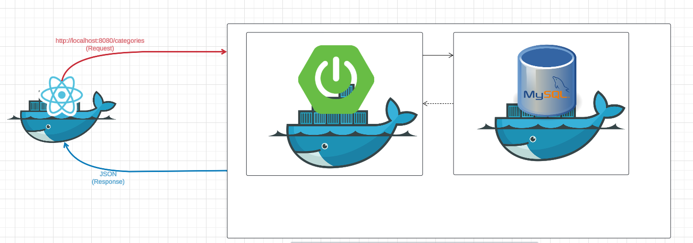

# Easyshop-E-commerce-advanced

## Website overview
This website is a user-friendly online e-commerce platform.
The front-end is developed using React.js, styled with Material UI and Bootstrap for a responsive and modern user interface. It communicates with the Spring Boot back-end through RESTful APIs, with Axios handling HTTP requests. The back-end is structured with dedicated controller layers to manage API responses. The application is secured using Spring Security, and user authentication is implemented via JWT (JSON Web Tokens). The entire application is containerized using Docker for consistent deployment across environments.

## Tools used

* HTML, CSS, Bootstrap, MUI
* React.js
* Spring boot
* Spring secuirty
* JWT Tokens
* Docker

## Front-end
HTML, CSS, Bootstrap, MUI, React.js

### Home Page


### Shop


### Responsiveness


* Responsive design implemented using CSS and Material UI, ensuring compatibility across devices including desktops, tablets, and mobile phones

## API call to backend

The code below makes an API call to the backend to get the data in the cart and displays it in the front-end

```Javascript
useEffect(() => {
    const getCart = async () => {
      const url = `${baseUrl}/cart`
      try{
        const response = await axios.get(url, {
          headers: { // passing the current user token every time the req is called
              'Authorization': `Bearer ${currentUser.token}`,
            },
        })
        if(response.data.items && typeof response.data.items === 'object')
        {
          setCartItemsData(Object.values(response.data.items));
          setCartData(response.data)
          console.log(Object.values(response.data.items))
        }
      }
      catch(error)
      {
        displayMessage("Failed to load cart", "Error")
      }
    }
    getCart();
  }, [])

```

## BACK END

## Diagram

([Link for diagram](https://lucid.app/lucidchart/0d55c612-f50c-4b17-9621-9e9d3adc7cc4/edit?viewport_loc=-1201%2C-1369%2C2994%2C1452%2C0_0&invitationId=inv_c38d4138-bce2-4911-960d-0b76ab51be17))

The back-end is designed in the pattern above. The MVC pattern. The api call goes to the controller and the controllers calls a functions in the DAO. The DAO makes models depending on the call the was made examples would be a call to get the products. The DAO would make the product models and add it to the list. The list then gets sent back to the front-end in a json String.

When the cart page is opened the API call would go to this endpoint. 

```java
@GetMapping("/cart")
    public ShoppingCart getCart(Principal principal)
    {
        try
        {
            // getting username from current user
            String userName = principal.getName();

            // getting user by name then getting the user id
            User user = userDao.getByUserName(userName);
            int userId = user.getId();

            // use the shoppingcartDao to get all items in the cart and return the cart
            return shoppingCartDao.getByUserId(userId);
        }
        catch(Exception e)
        {
            throw new ResponseStatusException(HttpStatus.BAD_REQUEST, "Oops... our bad.");
        }
    }
```

An example of the DAO is below
```java
@Override
    public ShoppingCart getByUserId(int userId) {
        ShoppingCart shoppingCart = new ShoppingCart();
        // getting the shopping cart with the user id
        String sql = """
                SELECT *
                FROM shopping_cart
                WHERE user_id = ?;
                """;

        try(Connection connection = getConnection())
        {
            PreparedStatement preparedStatement = connection.prepareStatement(sql);
            preparedStatement.setInt(1, userId);
            ResultSet row = preparedStatement.executeQuery();

            while(row.next())
            {
                // getting all the shopping item and adding them to the shopping cart class
                ShoppingCartItem shoppingCartItem = mapToItem(row);
                shoppingCart.add(shoppingCartItem);
            }
        }
        catch (Exception e)
        {
            throw new RuntimeException(e);
        }
        // returning shopping cart to the api call
        return shoppingCart;
    }
```

# Docker
This application is containrized using docker. There are 3 docker containers in this application. One for the front-end, one for the backend, and one for the database.



# How to run the project

1) Clone the repo to your computer
2) Run the database file on mySql
3) Open the backend server on your intelliJ, go to src/main/resource/application.properties
4) Make sure that the password for the database matches the one on your computer in the application properties
5) Run the backend server on intelliJ 
6) Open the easyshop client on vs code
7) Open the terminal and type "npm start"

# Run project on docker

1) Clone the repo to your computer
2) Make sure to have docker on your computer
3) Open the repo on VS code
4) Open the terminal and enter "Docker compose up --build"
